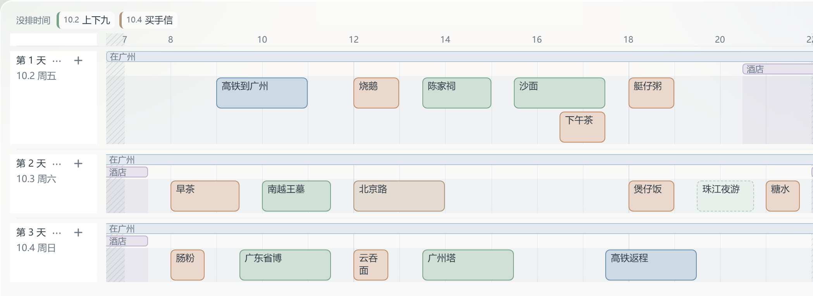
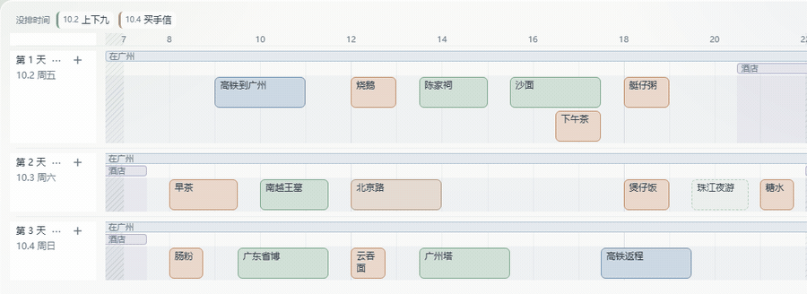
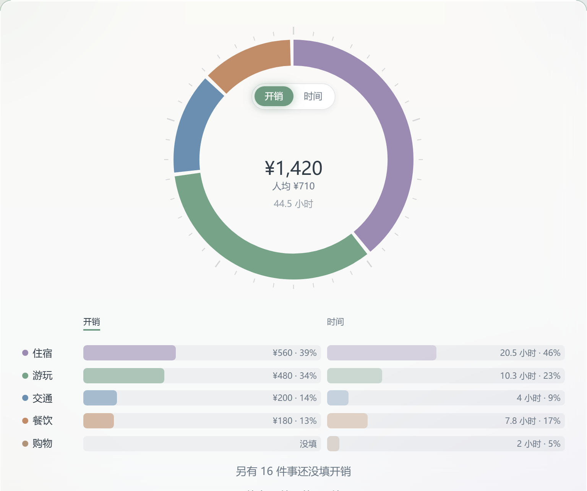
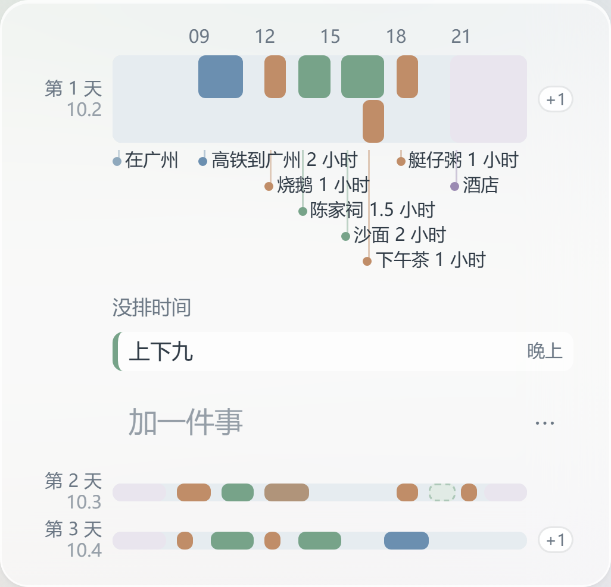

# 葱葱 WelshOnion

排计划的工具：每件事按时长排成一段，摆在时间线上。哪天塞太满、哪段空着，排的时候就看得出来。



清单记得住要做什么，但看不出做不做得完。

拖一下就改时间，松手之前就看得到改完的样子：



开销挂在事上，一个环看出各类各占多少、还有几笔没填。只呈现，不打分——什么叫排得好，标准在你心里：



手机上是同一条时间线，几天堆在一起，点开哪天看哪天：



## 怎么用

- **网页版**：<https://app.welshonion.com>，不用注册。第一次进去点「看看示例计划」。浏览器里还能装到桌面，断网也打得开。
- **安卓**：<https://welshonion.com> 上有安装包。

计划存在你自己的设备上，不上传任何服务器。

## 这个仓库

离线版的完整源码，不依赖任何服务器。登录、多设备同步、和同伴一起改这些要联网的功能不在这里。

## 自己跑

需要 Node 22 以上和 pnpm。

```bash
pnpm install
pnpm --dir apps/web dev     # 开发模式
pnpm test                   # 单元测试
pnpm --dir apps/web e2e     # 真浏览器走查
```

打安卓安装包还要 JDK 21 和安卓 SDK：`pnpm --dir apps/web app:apk`

## 代码

- `packages/core`：数据结构、所有改数据的操作、时间和开销的统计规则，用 [Yjs](https://github.com/yjs/yjs) 存。不碰界面。
- `apps/web`：界面。时间线、日程、总览三个视图，本机存储、离线安装，用 [Capacitor](https://capacitorjs.com/) 打成安卓 app。

## 交流

[LINUX DO](https://linux.do)

## 许可证

[AGPL-3.0](LICENSE)
